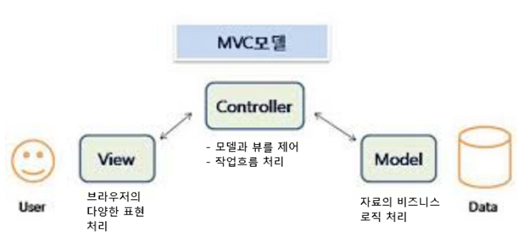
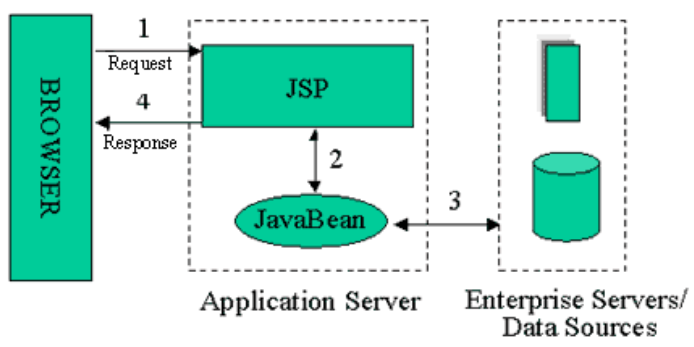
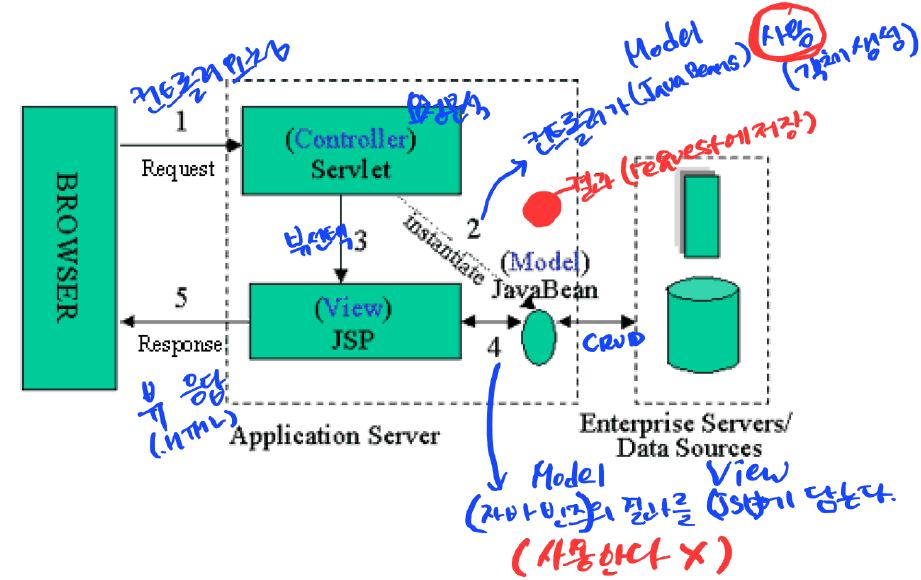

# MVC 모델

## MVC(Model, View, Controller) 모델

- 1979년 스몰톡이라는 객체지향 언어를 사용한 사용자 인터페이스 개발에 소개된 개념, 오랫동안 GUI개발 분야에서 사용된 개발 패턴
- 새로운 개발 방법이 아니라 기존의 MVC개발 모델이 웹 응용프로그램개발에도 적합하다는 것이 입증된 것
- MVC모델은 웹 응용프로그램을 구성하는 서버모듈을 **사용자에게 보이는 표현**을 *뷰(View)*,  **자료의 비즈니스 로직 처리** 를 *모델(Model)*, **흐름을 제어하는** *컨트롤러(Controller)*로 분리하여 개발하는 모델
- JSP와 javabeans로 개발한 Model1의 경우 비즈니스 로직과 표현을 완전히 분리하기 쉽지 않을뿐만 아니라 프로젝트 규모가 커질수록 더욱 어려워짐
- 해결책으로 **비즈니스 로직과 표현을 분리하여 개발** 하고자 하는것이 Model2, **MVC모델**
- 장점
  - 웹 응용프로그램의 **수정이 쉬움**
  - 웹 응용프로그램의 **확장이 쉬움**
  - 웹 응용프로그램의 **유지보수가 쉬움**

|  MVC요소   | 구현 프로그램 |                         역할                          |
| :--------: | :-----------: | :---------------------------------------------------: |
|   Model    |   javabeans   |                   비즈니스로직처리                    |
|    View    |   jsp, html   |                         표현                          |
| Controller |    servlet    | 적절한 Model을 사용,처리하여 뷰로 이동시키는 제어처리 |

## Model1과 Model2

1. Model1(**JSP+JavaBeans**)

2. Model2(**MVC**)

   

